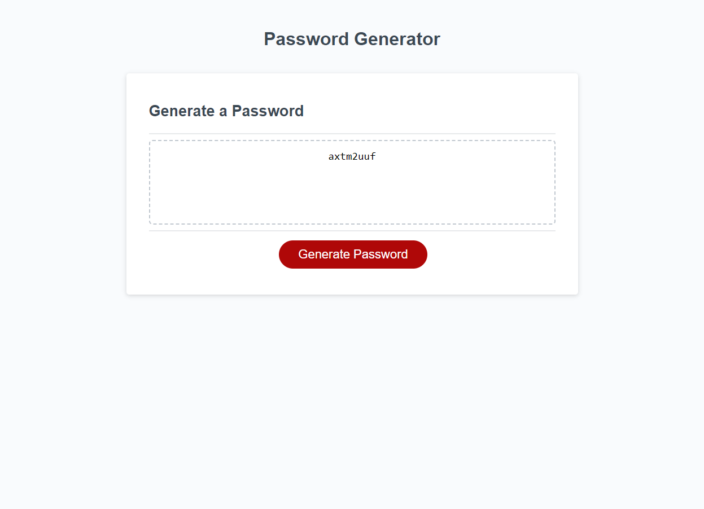

# Password Generator

* In this assignment I have been tasked with creating JavaScript that will allow me to generate a new password when the "Generate Password" button is clicked. When clicked, you will be given a series of prompts that allows the user to set the character length aswell as choose if the user would like to have Uppercase characters, if the user would like Lowercase characters, if the user would like numbers added to the password, or if they would like to add special characters to the password. Given that the user chooses the right amount of characters (between 8 and 128 characters), a password will be provided. If the wrong amount of characters is chosen, then the prompts will start over, and so on until the correct parameters are met. The HTML code and the CSS styling were provided, and were not altered in any way as to preserve the look of the site.

## My Finished Work:

* Link: https://msigala96.github.io/Password-Generator/

